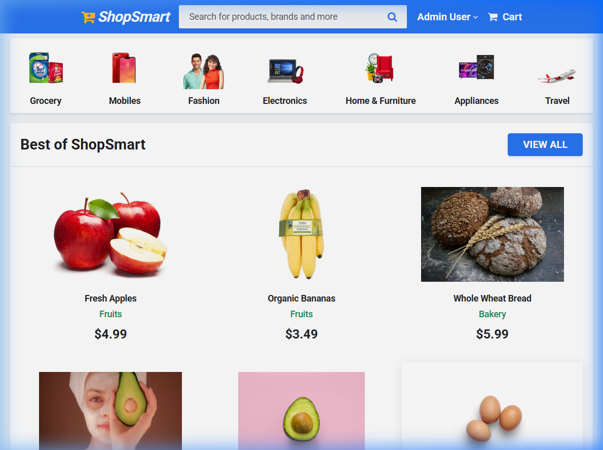
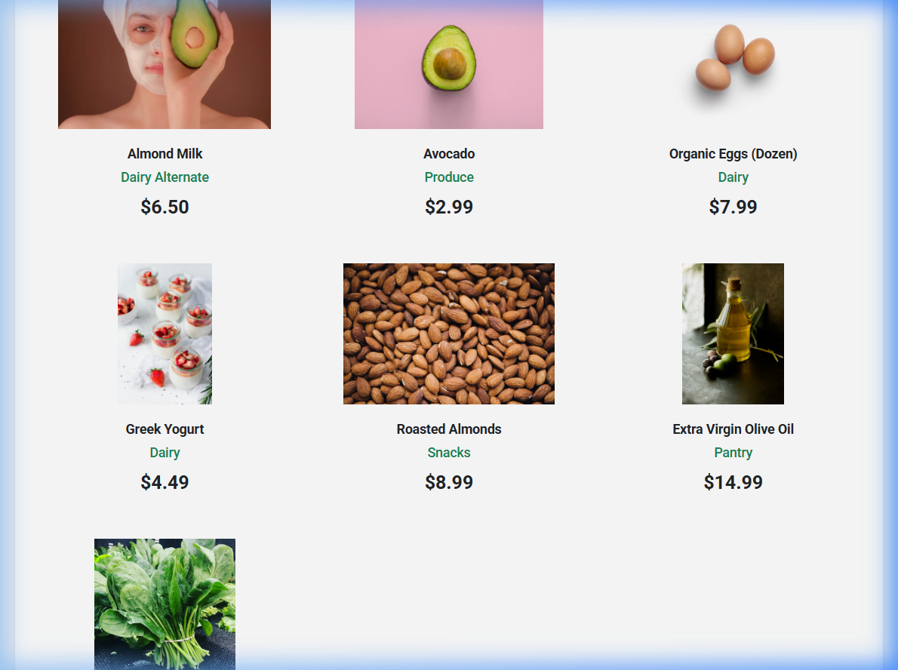
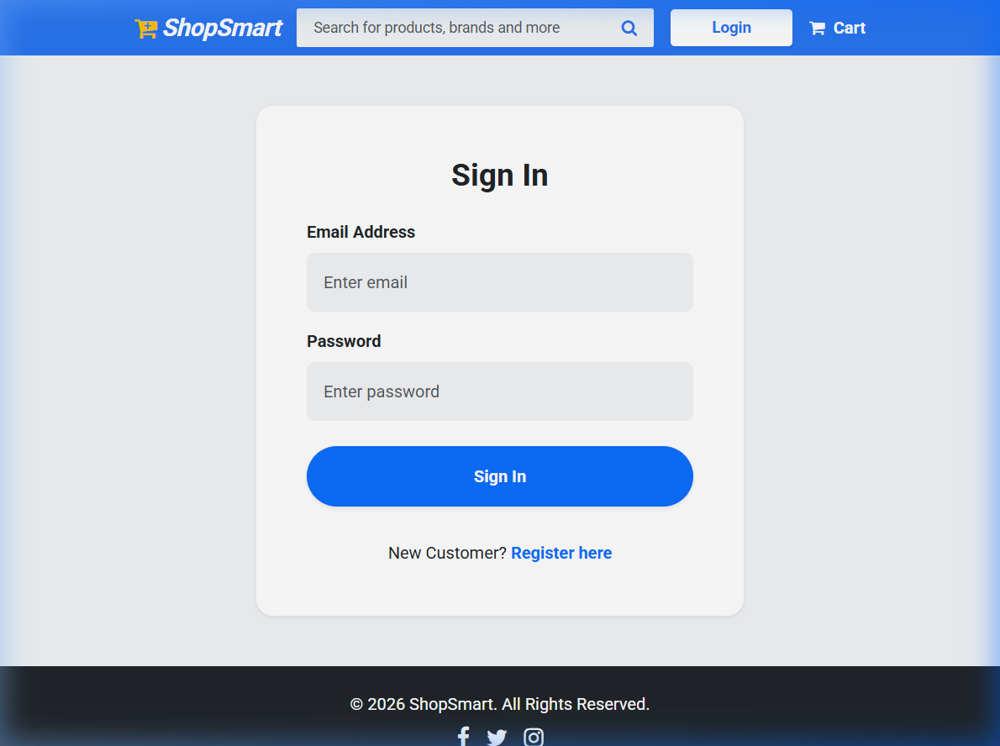
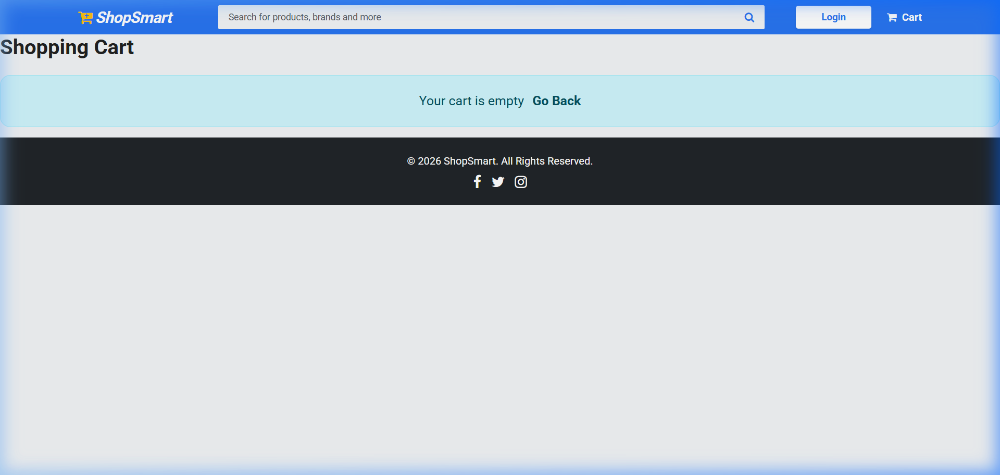
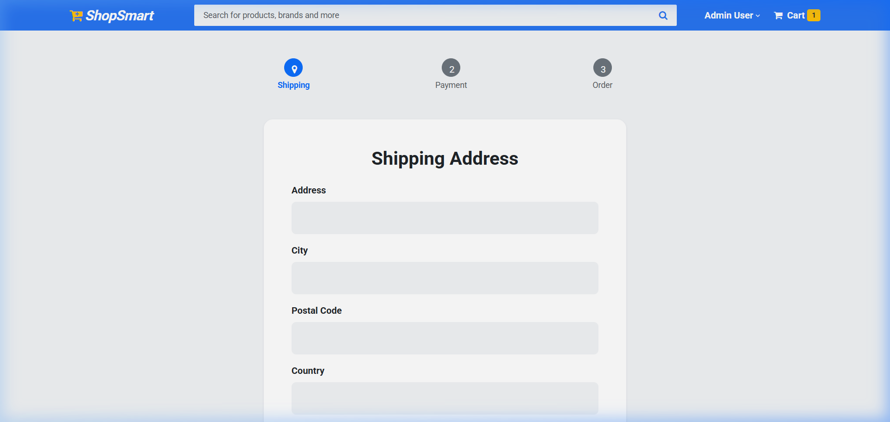
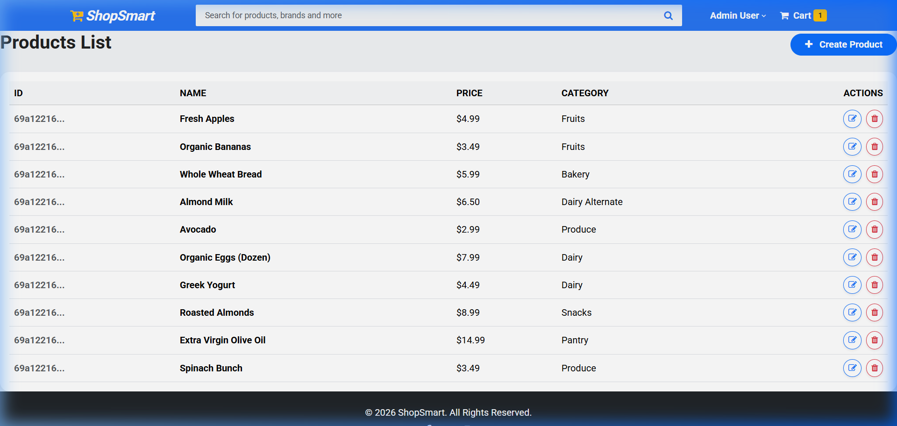

# ShopSmart - Grocery Web Application

## Project Description
ShopSmart is a modern, responsive, full-stack grocery e-commerce application designed to provide users with a seamless shopping experience. It features user authentication, a product catalog, a shopping cart, a mock payment checkout system (Stripe + COD), and a dedicated admin dashboard for managing inventory and orders. The UI is custom-designed, taking inspiration from leading e-commerce platforms like Flipkart.

## Tech Stack
- **Frontend:** Angular (v18+), Bootstrap 5, FontAwesome, HTML5, CSS3
- **Backend:** Node.js, Express.js
- **Database:** MongoDB (Mongoose ORM)
- **Authentication:** JSON Web Tokens (JWT), bcrypt.js
- **Payments:** Stripe API (Test Mode Integration)

## System Architecture Explanation
ShopSmart follows a classic 3-tier Client-Server architecture:
1. **Presentation Layer (Client):** The Angular frontend handles the user interface, state management, and routing. It communicates securely with the backend via RESTful APIs, attaching JWT tokens via HTTP Interceptors.
2. **Application Layer (Server):** The Express server receives requests, manages authorization via middleware guards, processes business logic (e.g. cart totals, order statuses), and interacts with the database.
3. **Data Layer (Database):** MongoDB stores the application's persistent state. Document collections include Users, Products, and Orders, mapped logically to application models via Mongoose.

## ER Diagram Explanation
The database schema consists of three core interactive entities:
- **User:** Stores authentication details (email, hashed password), profile data, and an `isAdmin` boolean flag for Role-Based Access.
- **Product:** Stores inventory information (name, price, category, stock count, image URLs).
- **Order:** A transactional entity linking a User's ID to an array of purchased Product references. It also tracks the total price, shipping address, payment method (Stripe/COD), and delivery status.
*(A user can have multiple orders. Each order contains multiple products and belongs to one user).*

## Folder Structure
```
ShopSmart_Project/
├── client/                 # Angular Frontend Application
│   ├── src/app/core        # Authentication, Guards, Interceptors, Global Services
│   ├── src/app/features    # Page Modules (Home, Shop, Cart, Admin)
│   └── src/app/shared      # Reusable UI (Navbar, Footer, Product Cards)
├── server/                 # Node.js + Express Backend
│   ├── controllers/        # Route Logic Handlers
│   ├── models/             # Mongoose DB Schemas
│   ├── routes/             # Express API Endpoints
│   └── middleware/         # Auth & Error Handling Interceptors
└── Project_Deliverables/   # Screenshots, Documentation, and Reports
```

## Installation Steps
### Prerequisites
- Node.js (v18+)
- MongoDB (Running locally or an Atlas URI)
- Angular CLI installed globally (`npm install -g @angular/cli`)

### Backend Setup
1. Navigate to the server folder: `cd server`
2. Install dependencies: `npm install`
3. Configure the `.env` file (see below).
4. Run the development server: `npm run dev` (Starts on port 5000)

### Frontend Setup
1. Navigate to the client folder: `cd client`
2. Install dependencies: `npm install`
3. Run the Angular development server: `npm start` (Starts on port 4200)

## Environment Variables Required
Create a `.env` file in the `server` directory with the following keys:
```env
NODE_ENV=development
PORT=5000
MONGO_URI=mongodb://127.0.0.1:27017/shopsmart
JWT_SECRET=your_jwt_strong_secret_key
STRIPE_SECRET_KEY=sk_test_placeholder_key
```

## API Endpoints List
### Authentication (`/api/users`)
- `POST /api/users/login` - Authenticate user & get JWT
- `POST /api/users/register` - Register a new user
- `GET /api/users/profile` - Get logged-in user profile (Private)

### Products (`/api/products`)
- `GET /api/products` - Fetch all products (Public)
- `GET /api/products/:id` - Fetch single product by ID (Public)
- `POST /api/products` - Create a product (Admin only)
- `PUT /api/products/:id` - Update a product (Admin only)
- `DELETE /api/products/:id` - Delete a product (Admin only)

### Orders (`/api/orders`)
- `POST /api/orders` - Create a new order (Private)
- `GET /api/orders/myorders` - Get current user's orders (Private)
- `GET /api/orders/:id` - Get order by ID (Private)
- `GET /api/orders` - Get all system orders (Admin only)

## Role-Based Access (Admin/User)
The application implements strict Role-Based Access Control (RBAC). 
- **Standard Users:** Can browse products, manage their cart, place orders, and view their personal order history. Protected by the `authGuard`.
- **Admin Users:** Granted the `isAdmin` boolean flag. They have access to the Admin Dashboard to manage global inventory (add/edit/delete products) and oversee all customer orders. Protected by the custom `adminGuard`.

## Security Features
1. **Password Hashing:** Utilizing `bcrypt.js` to cryptographically salt and hash all user passwords before database insertion.
2. **JWT Authorization:** Stateless API authentication using JSON Web Tokens. Passwords are theoretically never sent after the initial login exchange.
3. **HTTP Secure Headers:** The `helmet` middleware is implemented on the backend express server to prevent common XSS and clickjacking attacks.
4. **CORS Protection:** Cross-Origin Resource Sharing is strictly configured to only accept requests from the Angular client domain.
5. **Route Guards:** Angular `CanActivate` guards prevent unauthorized individuals from viewing sensitive application routes.

## Screenshots Section
See the `Project_Deliverables/Screenshots` folder for visual references:
- 
- 
- 
- 
- 
- 
- 

## Deployment Link Section
The live links to the application are documented in `Project_Deliverables/Deployment_Link.txt`.
- **Live Application URL:** [INSERT_YOUR_DEPLOYMENT_LINK]
- **Backend API URL:** [INSERT_BACKEND_LINK]

## GitHub Repository Link
You can review the full source code and commit history here:
**[INSERT_YOUR_GITHUB_REPOSITORY_LINK]**

## Conclusion
ShopSmart successfully demonstrates a scalable, secure, and fully operational modern monolithic web application utilizing the MEAN/MERN architectural patterns. The integration of role-based routing, strict security headers, and an elegant UI successfully meets the requirements of a production-ready e-commerce platform.
